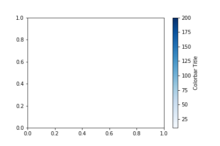
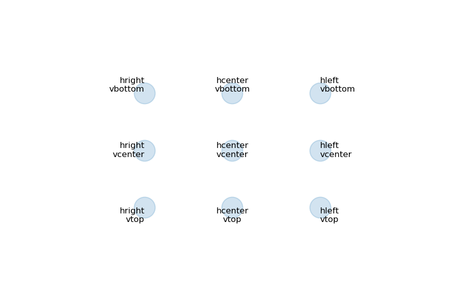
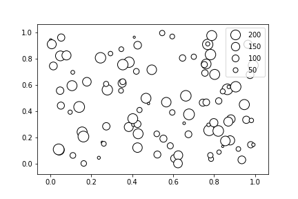

## Matplotlib Routines

### 1. How to Set Custom Colorbar

```python
import matplotlib as mpl

# Get colormap of range [0,1]
color_map = mpl.cm.get_cmap('Blues') 

# Set normalizer to your data range
norm = mpl.colors.Normalize(vmin=10, vmax=200) 

# Function to get color based on scalar values
get_color = lambda x : color_map(norm(x))

# Get color corresponding to value
get_color(200)

# Set scalar mappable, to allow plotting of colorbar
scalar_map = mpl.cm.ScalarMappable(norm=norm, cmap=color_map)

# Plot colorbar onto figure
plt.colorbar(scalar_map, label='Colorbar Title')
```



### 2. Annotation Alignment

```python
x = [1,2,3] * 3
y = [0 for i in range(3)] + [1 for i in range(3)] + [2 for i in range(3)]

plt.scatter(x,y, s=400, alpha=0.2)
plt.xlim(min(x) - 1, max(x) + 1)
plt.ylim(min(y) - 1, max(y) + 1)

plt.annotate('hcenter\nvcenter', (2,1), ha='center', va='center', fontsize=8)
plt.annotate('hcenter\nvtop', (2,0), ha='center', va='top', fontsize=8)
plt.annotate('hcenter\nvbottom', (2,2), ha='center', va='bottom', fontsize=8)

plt.annotate('hleft\nvcenter', (3,1), ha='left', va='center', fontsize=8)
plt.annotate('hleft\nvtop', (3,0), ha='left', va='top', fontsize=8)
plt.annotate('hleft\nvbottom', (3,2), ha='left', va='bottom', fontsize=8)

plt.annotate('hright\nvcenter', (1,1), ha='right', va='center', fontsize=8)
plt.annotate('hright\nvtop', (1,0), ha='right', va='top', fontsize=8)
plt.annotate('hright\nvbottom', (1,2), ha='right', va='bottom', fontsize=8)

plt.axis('off')
```



### 3. Get Legend Handle for Different Scatter Size

```python
x = np.random.rand(100)
y = np.random.rand(100)
s = np.random.randint(10,250,100)

sc = plt.scatter(x,y,s,color='white',edgecolor='black')

# can be sizes or colors
# num can be int or list
handle, label = sc.legend_elements('sizes', num=[200,150,100,50], color='white', 
                                  mec='black')

plt.legend(handle, label)
```



